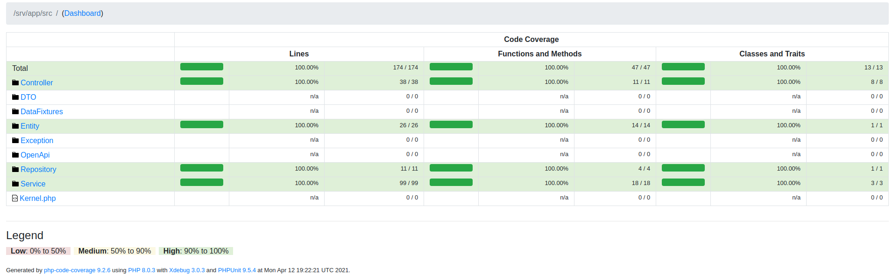

## Description
* All API methods are described in [openapi /docs](http://localhost/docs).
* The application doesn't require any auth.
* Images are stored in *app/images* and available via *DownloadController* for save original file name.
* Based on **PHP 8.0**, **Symfony 5**, **API-Platform 2.7**, **PostgreSQL 13.2**
## Docker compose
The application is placed in */srv/app* and starts with php *start.sh*
### Copy docker config
```shell
cp docker/.env.distr docker/.env
```
### Copy php configs
```shell
cp app/.env.dev app/.env.dev.local
cp app/.env.test app/.env.test.local
cp app/phpunit.xml.dist app/phpunit.xml
```
### Run docker
```shell
docker/docker-compose up -d
```
## Useful commands inside php container
### Run code style fixer and php analyzer
```shell
composer check-quality
```
### Generate tests coverage report in var/coverage.html
Tests coverage is 100%

```shell
composer generate-coverage
```
### Run tests
```shell
composer test
```
